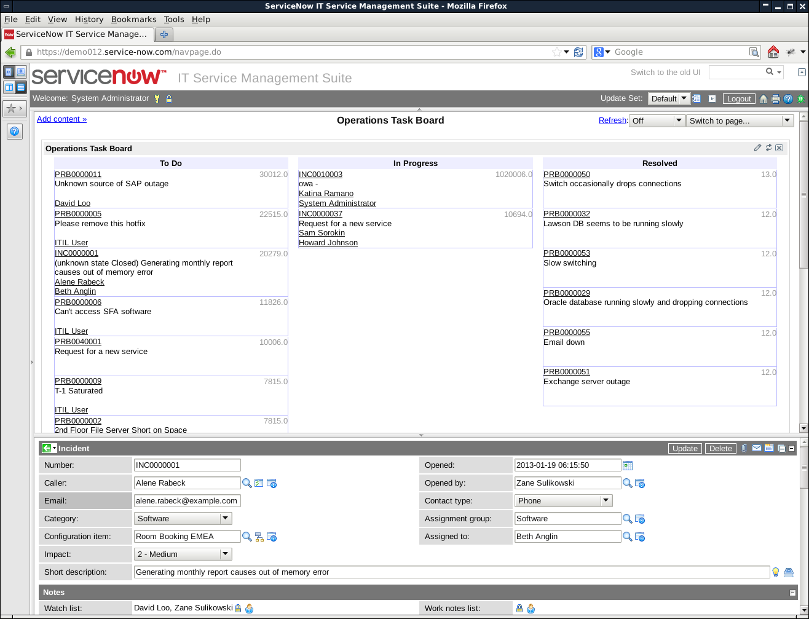

# Operations Task Board for Service Now

## Preview

## Installation

1. Compile and execute DynamicBlockProcessor
    1. `mkdir -p target`
    1. `javac -d target src/main/java/ca/eqv/servicenow/taskboard/DynamicBlockProcessor.java`
    1. `java -cp target ca.eqv.servicenow.taskboard.DynamicBlockProcessor`
1. Create the Dynamic block in Service Now (Content Management module)
    1. Enable Two Phase mode
    1. Copy-paste target/taskboard.xml into the Dynamic Content area

